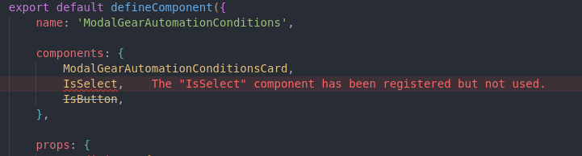
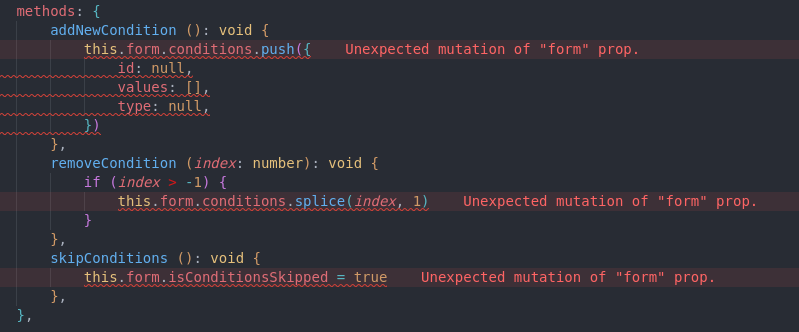
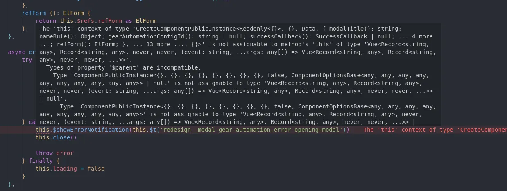

# Decorators to Options API Transpiler

</img> 

This project was made possible by the wonderful people at [Infraspeak](https://infraspeak.com/en).

This program was created to batch migrate vue components using the [Class Property Decorators](https://class-component.vuejs.org/) to regular [Options API syntax](https://vuejs.org/guide/introduction.html). The goal is to deprecate the use of Class Property Decorators on a codebase, which is not compatible with Vue 3.

---

## Installing and Usage

1. Clone this repository somewhere in your computer

```bash
git git@github.com:Marantesss/decorators-to-object-api-transpiler.git
cd decorators-to-object-api-transpiler
```

2. Compile this project 

It is recommended to use [`nvm`](https://github.com/nvm-sh/nvm) (Node Version Manager) to use the correct version of [`node`](https://nodejs.org/en) and [`pnpm`](https://pnpm.io/)

```bash
nvm use               # use node 18.12.1 in .nvmrc
npm install -g pnpm   # install pnpm
pnpm install          # install dependencies
pnpm build            # build project to dist/ folder
```

3. Run the project with node

```bash
node dist <...args>
```


### Bonus: setup project alias and run as VSCode task

#### Alias

For your convenience, we recommend to add create a new alias/function to your shell config file, like so:

```bash
d2o() { # d2o (decorators-to-options) but call it whatever you want
  nvm run 18.12.1 <decorators-to-options-api-folder>/dist/index.js "$@"
}
```

Note that we're using `nvm` to run the project with `node` `18.12.1` and also support arguments with `"$@"`.

Refreshing your shell session, you can now run the project anywhere:

```
$ d2o
Running node v18.12.1 (npm v8.19.2)
Usage: Decorators to Options API d2o <filepaths>

This CLI converts Vue SFC using class decorators syntax to regular options API

Options:
  -V, --version               output the version number
  -f, --files <filepaths...>  Accept file paths or globs (default: [])
  -l, --linter <filepath>     Accept linter config file path, "./.eslintrc.js" by default
  -s, --silent                DO NOT log stuff to console (default: false)
  -h, --help                  display help for command
```

#### VSCode task 


To make use of this tool from VSCode we need to setup a custom task. For maximum convenience we’ll also setup a key binding for this new task.

Open or create file `<web-core-client-repo>/.vscode/tasks.json` and add a new task:

```json
{
  "label": "decorators-to-options-api",
  "type": "shell",
  "command": "d2o -f ${file} -l ./.eslintrc.js",
  "presentation": {
	  "reveal": "silent",
	  "panel": "new"
  }
}
```

Just remember to define your current setup by changing the `<decorators-to-options-api-folder>` to your actual path.

Secondly, you can add the following to your `keybindings.json`. Instructions on how to do so are available on [VSCode’s docs](https://code.visualstudio.com/docs/getstarted/keybindings#_advanced-customization).

```json
{
	"key": "F10", // feel free to change this to something else
	"command": "workbench.action.tasks.runTask",
	"args": "decorators-to-options-api" // this must be the same as label task property
}
```

Finally, if you're getting an `command not found: d2o` error, then it's because your vscode's terminal is not reading your shell config file. You can change that in the `settings.json` file by adding the following lines:

```json
// you should change these values to osx or windows depending on your OS
// also, if your not using zsh, and are using bash, fish or even WSL, please check the documentation on how to correctly config this
"terminal.integrated.defaultProfile.linux": "zsh",
"terminal.integrated.profiles.linux": { "zsh": { "path": "/bin/zsh", "args": ["-l", "-i"] } }
```

## Limitations

There are however, some limitations which must be fixed by hand after generating an options API component:

1. JSDOC is ignored during AST generation and therefore is lost on the generated component;
2. Some of `ESLint` styles might not work at first (not sure why), therefore it is recommended to re-run the linter manually on generated files;
3. Vue's Options API Syntax has a few caveats regarding type support, so please make sure everything is working before committing your changes;

## How to contribute

This project makes use of:
- [`node`](https://nodejs.org/en/) version `18.12.1`
- [`pnpm`](https://pnpm.io/) version `7.26.3`
- [`typescript`](https://www.typescriptlang.org/) version `^4.9.5`

It is recommended to use [`nvm`](https://github.com/nvm-sh/nvm) (Node Version Manager) to use the correct version of `node` and `pnpm`

Open the project on root folder and run

```bash
nvm use
```

to start using the desired node version.

Then, install `pnpm` with:

```bash
npm install -g pnpm
```

You can now start the project with:

```bash
pnpm install # install dependencies
pnpm dev # run nodemon with ts-node to start a development run
```

## Features and TO-DOs

### Priority

- [X] Read Vue SFC and extract `<script>` - thanks to [`vue-sfc-parser`](https://github.com/ktsn/vue-sfc-parser)
- [X] Generate the AST and translate most common SFC class methods and decorators to Options API Syntax
    - [X] `@Component`
    - [X] `@Prop`
    - [X] `@Watch`
        - [ ] Don't generate a dedicated method, place logic on handler
    - [X] `@Emit`
        - [X] We can also make use of `emits` property to [Type component emits](https://vuejs.org/guide/typescript/options-api.html#typing-component-emits)
    - [X] `@Ref`
    - [X] class getters to `computed`
    - [X] class methods to `methods`
    - [X] class properties to `data`
        - [X] ~~Create internal type for type checking component data~~ (removed with the use of `defineComponent`)
    - [X] class `readonly` properties to type `readonly` properties on data return type (~~class `readonly` properties to `computed`~~)
    - [X] `Mixins`
- [X] Take care of vue lifecyle hooks
    - [X] `beforeCreate`
    - [X] `created`
    - [X] `beforeMount`
    - [X] `mounted`
    - [X] `beforeUpdate`
    - [X] `updated`
    - [X] `beforeUnmount` (vue 3) / `beforeDestroy` (vue 2)
    - [X] `unmounted` (vue 3) / `destroyed` (vue 2)
- [X] Write generated code on disk
    - [X] Create and write to NEW vue SFC (Ex: `component.vue` to `component.options.vue`)
    - [X] Replace script on current SFC
- [X] Batch process `*.vue` files in folders
    - [X] Accept glob syntax
- [X] [Run eslint](https://eslint.org/docs/latest/integrate/nodejs-api) (code formatter) with our configuration on generated code
    - [X] Double quotes (`""`) should become single quotes (`''`)
    - [X] Use 4 spaces as tab size
    - [X] Leave trailing commas
    - [X] Delete `;`
    - [X] Delete line terminators from interfaces
- [X] Write as much tests as possible
    - [X] Compare input class-based component script with output options-based component script (both are `string` data type)
    - [X] From class-based component script to data structure
    - [X] From data structure to generated code
- [ ] Generate AST for better type inference
    - [ ] Preserve JSDoc with complex AST (`JSDOC` node type)
    - [ ] Use generated AST
- [X] Use [`defineComponent`](https://vuejs.org/guide/typescript/options-api.html) instead of `Vue.extends` for better type inference

### Nice to have

- [ ] Generate the AST and translate **less common SFC decorators** to Options API Syntax
    - [ ] `@PropSync`
    - [ ] `@Model`
    - [ ] `@ModelSync`
    - [ ] `@Provide`
    - [ ] `@Inject`
    - [ ] `@ProvideReactive`
    - [ ] `@InjectReactive`
    - [ ] `@VModel`
- [ ] Do the exact same thing but for `vuex` stores
    - [ ] `@Store`
    - [ ] `@Action`
    - [ ] `@Mutation`
    - [ ] class getters to `getters`
- [X] Create command line interface

## Main dependencies

- [`ts-morph`](https://ts-morph.com/) is a wrapper for `typescript` compiler API, which does most of the heavy lifting including generating and manipulating the AST (Abstract Syntax Tree)
- [`code-block-writer`](https://github.com/dsherret/code-block-writer) is a package which handles code JS/TS writing and formatting
- [`eslintrc`](https://eslint.org/docs/latest/integrate/nodejs-api#-new-eslintoptions) is a package which handles code JS/TS formatting. It's Node API allows us to format code programmatically.

## Important Notes

There are a few caveats to notice when using this tool.

### Some Data properties will have to be typed manually

In the following example `supportedConditions` has an inferred type, which is the return type of `getSupportedConfigConditionOptions` function.

```ts
export default class ModalGearAutomationConditions extends Vue {
    // supportedConditions has inferred type GearAutomationCondition[]
    readonly supportedConditions = getSupportedConfigConditionOptions(this.conditions)
}
```

After transpiling this component, the `Data` type will have type `any`, which will cause errors.

```ts
type Data = {
    readonly supportedConditions: any
}
```

will have to be changed to

```ts
type Data = {
    readonly supportedConditions: GearAutomationCondition[]
}
```

### Non-used imported components are now detected

It seems that Class-based components allow the declaration of `Components` via the `@Components` decorator, even if they are not used:

```ts
@Component({
    components: {
        ModalGearAutomationConditionsCard,
        IsSelect,
        IsButton,
    },
})
export default class ModalGearAutomationConditions extends Vue {
}
```

However, this is not the case for Options API-based components:



### Prop mutation is now detected

This is a critical problem with the Class-based component syntax, as prop manipulation is not detected.

```ts
export default class ModalGearAutomationConditions extends Vue {
    @Prop({ type: Object, required: true })
    readonly form!: IGearAutomationConfigForm

    addNewCondition (): void {
        this.form.conditions.push({
            id: null,
            values: [],
            type: null,
        })
    }
}
```

Not anymore:



### Plugins are not binded correctly to `this`



It seems that creating a typescript declaration file (`*.d.ts`) does not fix the issue.

## Examples

You can find examples on the `/vue` folder, which contains vue SFCs prefixed with `.options.vue` and `class-decorators.vue` for components using the Options API syntax and the class-based syntax respectively.

### Original SFC

```vue
<script lang="ts">
import { Component, Prop, Vue, Ref, Emit, Watch, mixins } from 'vue-property-decorator'
import NestedComponent from './NestedComponent.vue'
import AnotherNestedComponent from './NestedComponent.vue'
import MyMixin from './MyMixin.vue'

interface MyInterface {
    myProperty: string
}

// https://github.com/kaorun343/vue-property-decorator
@Component({
    components: {
        NestedComponent,
        AnotherNestedComponent,
    },
})
export default class ExampleComponent extends mixins(MyMixin) {
    // Refs
    @Ref('myDiv')
    readonly myDiv!: HTMLDivElement

    // Props
    @Prop({ type: Boolean, default: true })
    public readonly defaultBoolean!: boolean

    @Prop({ type: String, default: 'option 1' })
    public readonly defaultProp!: 'option 1' | 'option 2'

    @Prop({ type: String, required: true })
    public readonly requiredStringProp!: string

    @Prop({ type: String, required: false })
    public readonly notRequiredStringProp?: string

    @Prop({ type: Object })
    public readonly objectProp?: MyInterface


    // data
    readonly MY_CONST: number = 123
    myDataOne = 'stuff'
    private myPrivateData = 'more stuff'

    // Watch
    @Watch('myDataOne', { immediate: true, deep: true })
    onMyDataOne(newVal: string, oldVal:string) {
        console.log(`changed from ${oldVal} to ${newVal}!`)
    }

    // Emits
    @Emit('my-event')
    emitMyEvent (): void {}

    @Emit('my-event-with-payload-param')
    emitMyEventWithPayloadParam (num: number): void {
        this.myDataOne = 'other stuff'
    }

    @Emit('my-event-with-payload-return')
    emitMyEventWithPayloadReturn (num: number): string {
        this.myPrivateData = 'more more stuff'
        return this.myPrivateData
    }

    // computed
    get myDataOneUppercase () {
        return this.myDataOne.toUpperCase()
    }

    // methods
    logSomething (something: any): void {
        console.log(something)
    }

    doMath(a: number, b: number): number {
        return a + b
    }

    doSomethingWithRef() {
        this.myDiv.addEventListener('click', () => this.logSomething(this.doMath(1,1)))
    }

    emitAllTheThings (): void {
        this.emitMyEvent()
        this.emitMyEventWithPayloadParam(2)
        this.emitMyEventWithPayloadReturn(2)
    }
}
</script>
```

### Generated SFC

```vue
<script lang="ts">
import type { PropType } from 'vue'
import { defineComponent } from 'vue'

import NestedComponent from './NestedComponent.vue'
import AnotherNestedComponent from './NestedComponent.vue'
import MyMixin from './MyMixin.vue'

interface MyInterface {
    myProperty: string
}

export default defineComponent({
    name: 'ExampleComponent',

    components: {
        NestedComponent,
        AnotherNestedComponent,
    },

    mixins: [MyMixin],

    props: {
        defaultBoolean: {
            type: Boolean as PropType<boolean>,
            default: true,
        },
        defaultProp: {
            type: String as PropType<'option 1' | 'option 2'>,
            default: 'option 1',
        },
        requiredStringProp: {
            type: String as PropType<string>,
            required: true,
        },
        notRequiredStringProp: {
            type: String as PropType<string>,
            required: false,
        },
        objectProp: {
            type: Object as PropType<MyInterface>,
            required: false,
        },
    },

    emits: {
        'my-event' (): boolean {
            // TODO add validator
            return true
        },
        'my-event-with-payload-param' (num: number): boolean {
            // TODO add validator
            return true
        },
        'my-event-with-payload-return' (num: number): boolean {
            // TODO add validator
            return true
        },
    },

    data() {
        return {
            myDataOne: 'stuff',
            myPrivateData: 'more stuff',
            MY_CONST: 123
        }
    },

    watch: {
        myDataOne: {
            immediate: true,
            deep: true,
            handler: 'onMyDataOne',
        },
    },

    computed: {
        // refs
        myDiv(): HTMLDivElement {
            return this.$refs.myDiv as HTMLDivElement
        },
        myDataOneUppercase () {
            return this.myDataOne.toUpperCase()
        },
    },

    methods: {
        // Emits
        emitMyEvent (): void {
            this.$emit('my-event')
        },
        emitMyEventWithPayloadParam (num: number): void {
            this.myDataOne = 'other stuff'
            this.$emit('my-event-with-payload-param', num)
        },
        emitMyEventWithPayloadReturn (num: number): void {
            this.myPrivateData = 'more more stuff'
            this.$emit('my-event-with-payload-return', this.myPrivateData, num)
        },
        // Methods
        logSomething (something: any): void {
            console.log(something)
        },

        doMath(a: number, b: number): number {
            return a + b
        },

        doSomethingWithRef() {
            this.myDiv.addEventListener('click', () => this.logSomething(this.doMath(1,1)))
        },

        emitAllTheThings (): void {
            this.emitMyEvent()
            this.emitMyEventWithPayloadParam(2)
            this.emitMyEventWithPayloadReturn(2)
        },
        // watch methods
        onMyDataOne(newVal: string, oldVal:string) {
            console.log(`changed from ${oldVal} to ${newVal}!`)
        }
    }
})
</script>
```
